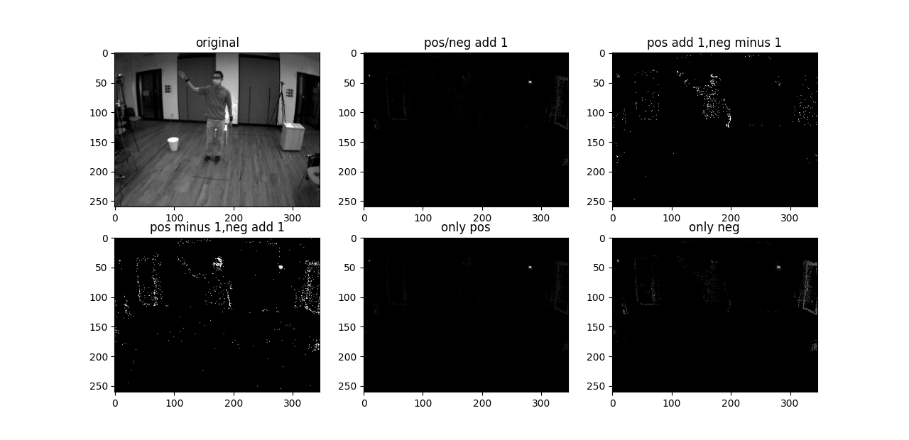
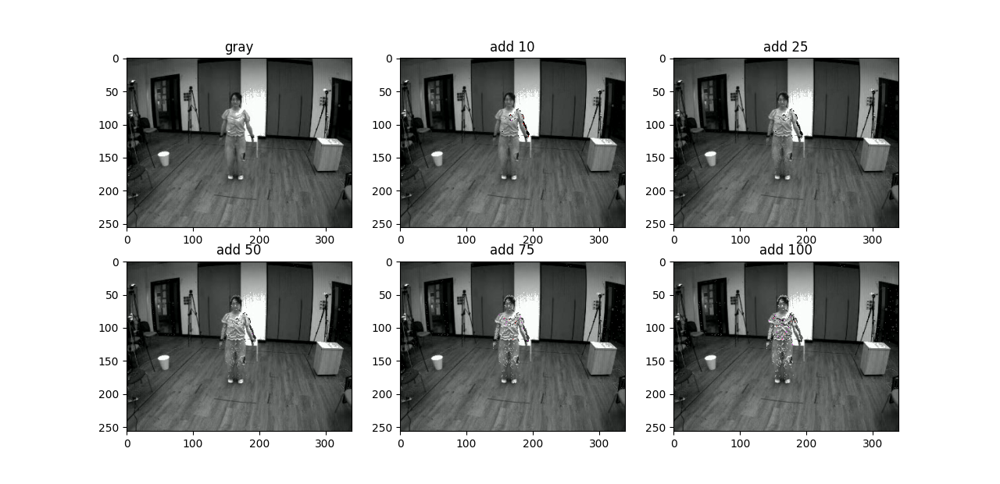
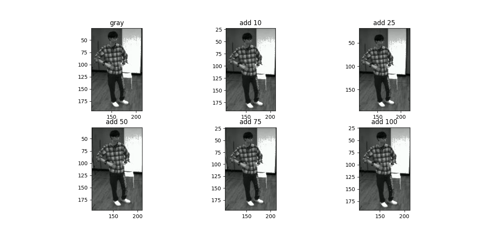
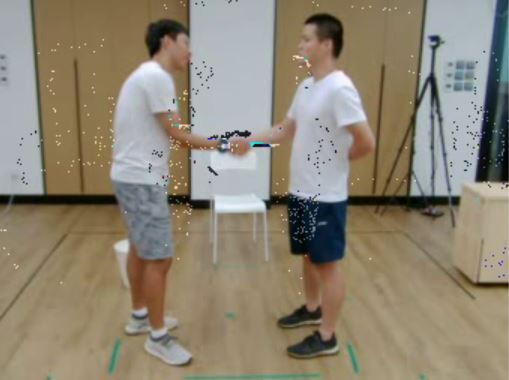

# Event-based-action-recognition
## Action Recognition with event-based camera data in Jupyter notebook   
The code is forked and modified from MMACTION TSM video understanding  
https://github.com/open-mmlab/mmaction2/blob/master/configs/recognition/tsm/README.md  
* We reconstructed event-based data to frames and apply TSM to event-generated frames, grayscale frames and RGB frames.  
* With data augmentation skills, the accuracy of action recognition can be on par with grayscale frames, or even RGB frames. For example, the horizonal flipping of event data can improve the ability of the model to distinguish among horizontal actions like pushing, boxing, etc.    
* We also investigated how the event-frame should be generated and how to augment grayscale frames with event points to achieve improvements.  

From below demonstration, we can see that in a fixed frame per (FPS) second scheme, with positive event point adding one, negative event point subtracting one, we can render an event-frame close to a binary image with noises strongly reduced. While the action part is obviously shown.    
<!-- [IMAGE] -->

After we get the binary event-frame, we may use it to augment the original grayscale frame because they share the same photosensor array in DAVIS (Dynamic and Active-pixel Vision Sensor) camera. From below graph, we chose an action with large and obvious movement, for each active pixel in event-frame, we add different values to grayscale frame. Because this action has large movement, even an addition of 10 can show the points.  

However, for some actions with mild or unobvious movements, a large addition can only show very few event points superpositions.  

If we want to augment the RGB frame, extra sensor fusion work is required which can be computational expensive compared to action recognition. Because events and RGB frames are captured from different cameras, there exist temporal and spatial biases.  

[1] Lin, Ji and Gan, Chuang and Han, Song, "TSM: Temporal Shift Module for Efficient Video Understanding", in Proceedings of the IEEE International Conference on Computer Vision, 2019, lin2019tsm   
[2] Xiaolong Wang and Ross Girshick and Abhinav Gupta and Kaiming He, "Non-local Neural Networks", CVPR, 2018, NonLocal2018
